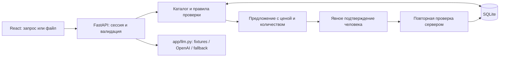

# Контур — проверяемая закупка электротоваров

**От запроса или спецификации — к корзине, состав которой проверил человек.** Контур помогает закупщику найти товар ekt.kz, сопоставить характеристики и наличие на складе, заметить противоречия и подтвердить покупаемое количество.

Демонстрация работает без API-ключей: **13 товаров, 3 склада, чат, проверка файлов и серверная корзина**. Данные — сохранённый снимок из 10 карточек ekt.kz и 3 явно отмеченные учебные позиции.

**Статус на 23.09.2026: живые OpenAI и OCR проверены.** С локально настроенными ключом и моделью `gpt-4.1-mini` выполнены реальные вызовы для ответа, разбора запроса и распознавания нового JPEG; повтор OCR использовал кэш. Ключ хранится в локальном `.env` вне Git. [Протокол проверки](docs/FINAL-QA.md).

[Видео · 73 с, с субтитрами](docs/assets/kontur-demo.mp4) · [Русские субтитры](docs/assets/kontur-demo.srt) · [Презентация](docs/pitch.html) · [Проверки проекта](docs/FINAL-QA.md)


## Проблема и ценность

Закупщику недостаточно найти похожее название: нужно сверить номинал, количество, единицу, склад и условия. Ошибка в одном исходном поле может привести к выбору неподходящего товара.

Контур сохраняет основания решения. В поставляемом каталоге у артикула `200300285_` описание указывает **160 А**, а свойство — **250 А**. Система показывает расхождение и блокирует предложение по спецификации, пока человек не исправит или не исключит проблемную строку. Цена и наличие повторно проверяются при подтверждении.

Результат демонстрации — проверенное предложение на **2 шт за 122 000 ₸**. Это стоимость корзины; экономия и сокращение времени закупки на пользователях пока не измерялись.

## Что умеет

- **Находить и объяснять:** поиск по артикулу/названию, карточка с характеристиками, минимумом заказа, источником и датой снимка; документы показываются при их наличии.
- **Подбирать и уточнять:** кандидаты по поддерживаемым требованиям, справочные вопросы о последнем товаре, наличие в Астане, Алматы и Шымкенте, справка по публичным условиям оплаты и доставки ekt.kz с датой и источниками.
- **Проверять основания:** конфликтующие поля видны отдельно; неизвестное значение отличается от нуля, общий остаток — от остатка выбранного склада.
- **Разбирать спецификацию:** XLSX, DOCX и текстовый PDF локально, новый JPEG через OpenAI в live-режиме, учебный JPEG по записанному результату; исправление количества, единиц и названий, исключение строк, результат проверки рядом с документом.
- **Собирать корзину с подтверждением:** добавление, изменение и удаление через конкретное предложение. Серверная корзина сохраняется после перезагрузки; повтор запроса не удваивает операцию.

## Архитектура



Один Python-процесс обслуживает API и готовый `web/dist`. SQLite хранит каталог, анонимные сессии, документы, предложения и корзины. Модель помогает разбирать информационные запросы и изображения; допустимость покупки, цены и суммы определяют серверные правила. Подтверждается конкретный ID предложения, включая текстовое подтверждение в интерфейсе.

Подробности: [архитектура](docs/ARCHITECTURE.md), [контракт API](docs/API-CONTRACT.md), [спецификация](docs/SPEC.md).

## Технологии

**Python 3.12, FastAPI, Pydantic, SQLite** позволяют запустить всё локально без отдельного сервера БД. **OpenAI SDK** используется через structured outputs, таймауты, повтор и резервный ответ по правилам.

**React, TypeScript, Vite, Tailwind и собственный CSS** формируют интерфейс без готовой UI-темы. Lucide, Motion, NumberFlow и шрифты Onest / Unbounded / IBM Plex Mono поставляются локально. CDN в работающем приложении нет. Зависимости закреплены в `uv.lock` и `web/package-lock.json`; для запуска готовой сборки Node.js не нужен.

## Быстрый старт

С установленными **Python 3.12** и **uv**, из корня клона:

```text
uv run hack serve
```

Откройте **http://127.0.0.1:8000**. Команда создаёт отсутствующую `data/app.db` и обслуживает готовый интерфейс. По умолчанию включён `DEMO_MODE=1`: `.env`, личные аккаунты и API-ключи не нужны. Сеть требуется для получения кода и первоначальной установки зависимостей; после установки демонстрация работает автономно.

## Установка

Для macOS и Windows 11 с Python 3.12 и uv:

```text
git clone https://github.com/BAITC-Hacks/hack-0a6c3bd5-ai-association.git
cd hack-0a6c3bd5-ai-association
uv sync --frozen
uv run hack serve
```

Для получения приватного репозитория нужен доступ GitHub; само приложение регистрации не требует. Если порт занят, используйте `uv run hack serve --port 8001` и откройте адрес с портом 8001.

**Без uv — macOS/Linux:**

```sh
python3.12 -m venv .venv
.venv/bin/python -m pip install -r requirements.txt
.venv/bin/python -m app.cli seed
.venv/bin/python -m uvicorn app.main:app --host 127.0.0.1 --port 8000
```

**Без uv — Windows 11 PowerShell:**

```powershell
py -3.12 -m venv .venv
.\.venv\Scripts\python.exe -m pip install -r requirements.txt
.\.venv\Scripts\python.exe -m app.cli seed
.\.venv\Scripts\python.exe -m uvicorn app.main:app --host 127.0.0.1 --port 8000
```

`seed` нужен перед первым прямым запуском uvicorn. При повторном запуске достаточно последней команды; `seed` не очищает пользовательские корзины.

**Docker Compose:** `docker compose up --build` при установленном Docker и запущенном daemon. Команда включает деморежим, сохраняет БД в именованном томе и подключает готовый `web/dist` из клона только для чтения. Порт 8000 должен быть свободен. На Docker 29.5.2 / Linux `python:3.12-slim` проверены новая БД и PDF-сценарий desktop/mobile до подтверждённой корзины и перезагрузки. `.dockerignore` исключает локальные ключи, БД, кэш и окружение из образа. Версии и результаты — [FINAL-QA.md](docs/FINAL-QA.md).

## Переменные окружения

Для демо ничего заполнять не нужно. Для настройки live в новом клоне скопируйте [.env.example](.env.example) в `.env`, задайте свои `OPENAI_API_KEY` и `OPENAI_MODEL` и перезапустите сервер. Поля шаблона намеренно оставлены пустыми; при успешной live-проверке ключ и модель были настроены локально. `.env` исключён из Git.

| Переменная | По умолчанию | Назначение |
|---|---|---|
| `DEMO_MODE` | `1` | Записанные ответы и локальные правила; `0` включает попытку живого вызова |
| `OPENAI_API_KEY` | Пусто | Ключ для live-режима, хранится только локально |
| `OPENAI_MODEL` | Пусто | Явно выбранная модель с поддержкой используемых structured outputs; для OCR также нужен ввод изображения |
| `DATABASE_PATH` | `data/app.db` в корне проекта | Файл SQLite |
| `ALLOWED_ORIGINS` | `http://127.0.0.1:5173,http://localhost:5173` | Разрешённые origin локального Vite; собственный origin сервера также разрешён |
| `EKT_API_USERNAME`, `EKT_API_PASSWORD` | Пусто | Только для явной команды `hack snapshot`; обычное демо их не использует |

Для явного выбора режима:

```text
uv run hack serve --mode demo
uv run hack serve --mode live
```

`--mode demo` принудительно включает автономный режим. `--mode live` использует ключ и модель из локального `.env` с приоритетом над унаследованными значениями этих переменных и обращается к `https://api.openai.com/v1`. Если этих значений в файле нет, можно задать их через окружение; явно пустое значение в `.env` считается ошибкой. Обычный `uv run hack serve` сохраняет стандартный выбор по `DEMO_MODE`; переменные процесса имеют приоритет над `.env`.

Явный `--mode live` требует непустые ключ и модель и при их отсутствии завершает запуск с понятной ошибкой. В обычном `serve` при `DEMO_MODE=0` без ключа/модели сохраняется fallback чата на локальные правила. При сетевой ошибке провайдера работающий чат также возвращается к правилам. Новый JPEG без доступного OCR получает понятную ошибку; строки не выдумываются. Поставляемый JPEG использует записанное извлечение даже в live-режиме.

Реальные ответ, разбор запроса и OCR нового JPEG проверены на `gpt-4.1-mini`; повтор OCR использовал кэш без нового API-вызова. Стандартный live-запуск проверен при устаревших наследованных ключе и модели. Подробности — [FINAL-QA.md](docs/FINAL-QA.md).

На Windows, если `uv` не найден в PATH, используйте `python -m uv` вместо `uv`. Для отдельного демопоказа при работающем сервере на 8000: `python -m uv run hack serve --mode demo --port 8001`, адрес `http://localhost:8001`. Другой порт сам по себе не создаёт отдельную БД; для показа используйте новый профиль браузера с пустой сессией.

## Проверка основного сценария

Начните в отдельном профиле браузера с новой сессией и пустой корзиной. Выберите склад **«Астана»**.

1. Откройте `/?view=upload`, раскройте «Нет файла? Возьмите учебный образец», скачайте PDF и загрузите его. Появятся **две редактируемые строки**.
2. Нажмите «Проверить по каталогу». На том же экране виден конфликт **160 / 250 А** у `200300285_`: предложения нет, корзина пуста.
3. Снимите отметку «Включить строку 2» и повторите проверку. Появится предложение **2 шт `DEMO-160-AVAILABLE` по 61 000 ₸**, итог **122 000 ₸**. Корзина ещё не изменена.
4. Нажмите «Проверить и подтвердить», сверьте состав и склад, затем «Подтверждаю добавление». Появится сообщение **«Корзина обновлена»**.
5. Откройте корзину и перезагрузите страницу: **2 шт и 122 000 ₸** сохраняются.
6. Установите количество 3 действием строки корзины и подтвердите новое предложение: итог станет **3 шт и 183 000 ₸**. Количество в предложении — конечное, а не добавка к имеющемуся.

Без файла начните на `/` с «Проверь товар 200300285_», затем «Добавь 2 шт DEMO-160-AVAILABLE». Подробный показ — [DEMO.md](docs/DEMO.md); поиск доступен на `/?view=catalog`, подтверждённая корзина — на `/cart`.

## Как это масштабируется

Для пилота с партнёром нужны согласованные права на данные, единицы учёта, документы, условия и обновление каталога. `app/adapters/ekt.py` уже получает отдельные карточки явной командой; полного импорта и обновления по расписанию в демонстрации нет.

Следующий шаг — подключить реальную корзину по предоставленному API, сохранив подтверждение и повторную проверку. Для другого каталога меняются адаптер и предметные правила. Выбор хранилища и масштабирование нагрузки должны опираться на измерения; нагрузочные испытания текущей версии не проводились.

## Ограничения и допущения

- **13 SKU: 10 карточек ekt.kz и 3 синтетические**, три склада. Источник и дата сохранены; это снимок, а не полный актуальный каталог. Единица демонстрационного набора задана через `demo.unit_override`.
- **Неизвестное не равно нулю:** `null` означает отсутствие данных. Локальный и общий остатки различаются. Отсутствующие фото и сертификаты не заменяются вымышленными.
- **Локальная корзина:** заказ, оплата и резервирование в ekt.kz не выполняются. Справка по оплате и доставке основана на [официальных условиях](https://ekt.kz/checkout-delivery/) и [FAQ](https://ekt.kz/about/faq/), проверенных 23.09.2026. Способ оплаты, срок и стоимость конкретного заказа подтверждает продавец. Из-за разных порогов бесплатной доставки на сайте прототип не рассчитывает тариф. Неуказанные в предложении позиции сохраняются, итоговое количество 0 означает удаление.
- **Файлы:** до 10 MiB, 50 строк; PDF до 10 страниц с текстовым слоем. Старые XLS/DOC и сканированные PDF не поддерживаются. Любая проблемная включённая строка блокирует предложение по всему списку.
- **JPEG:** без ключа распознаётся только точный учебный образец. Живой OCR передаёт изображение OpenAI; пользовательские файлы хранятся локально в SQLite своей сессии и не публикуются как статика.
- **Состояние интерфейса:** история чата и черновик сохраняются при переходах между экранами, но не после перезагрузки. Подтверждённая корзина восстанавливается через анонимную HttpOnly cookie.

## Соответствие критериям задачи

| Критерий кейса | Реализованное поведение | Где проверить |
|---|---|---|
| Сведения о товаре, характеристики, сертификаты | Карточка с исходными полями, источником и документами при наличии | `/?view=catalog`, `app/api/catalog.py` |
| Наличие по складу | Астана, Алматы, Шымкент; локальный остаток отдельно от общего | Выбор склада, карточка товара |
| Аналоги и уточняющие вопросы | Кандидаты по поддерживаемым требованиям, справочный контекст товара, паспорт расхождений | Чат, `app/agent/` |
| Оплата, доставка, минимальная партия | Справка по публичным условиям с датой и ссылками; минимум из карточки; спорные тарифы не рассчитываются | «Какие условия оплаты и доставки?», `data/purchase_terms.json` |
| Корзина после подтверждения | Конкретное предложение, явное согласие, повторная проверка, ссылка на корзину | `/cart`, `app/commerce.py` |
| Спецификация из файла | Извлечение, правка/исключение строк, проверка каталога без скрытого добавления | `/?view=upload`, `app/documents.py` |
| Запуск без личных доступов | Деморежим по умолчанию, готовая сборка и данные в репозитории | Быстрый старт, [финальная проверка](docs/FINAL-QA.md) |

## Команда

| Участник | GitHub | Вклад |
|---|---|---|
| Даниял · Windows 11 | [1nkarY](https://github.com/1nkarY) | Backend, SQLite, агент и правила, документы, API и серверные проверки |
| Мовсар · macOS | [tranquillww](https://github.com/tranquillww) | Интерфейс, интеграция API, браузерные проверки, документация, демонстрация |

[Организация работы](docs/TEAM.md) · [Почасовые результаты](PROGRESS.md) · [Журнал использования Codex](docs/codex-log.md)

## Сторонние компоненты

[CREDITS.md](CREDITS.md) раскрывает библиотеки и версии, лицензии, источники каталога, учебные данные и инструменты разработки. Лицензии поставляемых шрифтов и UI-компонентов находятся в `web/public/licenses` и копируются в `web/dist/licenses`. Для учебного PDF приложены лицензия DejaVu Sans и сведения о генераторе. Права на исходные материалы ekt.kz не объявляются собственностью команды.

## Разработка и проверка

**262 backend-теста прошли на macOS и Windows**; проверены каталог, сессии, предложения, повторы, четыре формата документов и резервный режим без ключа. На Windows 11 / Python 3.12.3 чистый клон объединённой технической версии `3757794` запущен без `.env`, ключей и Node: PDF-сценарий на 1440/390 px дал 2 шт / 122 000 ₸ после подтверждения и перезагрузки, без внешних запросов и ошибок JavaScript. Реальные OpenAI/OCR и Docker Compose также проверены. Точные версии, результаты и границы каждого прогона — в [FINAL-QA.md](docs/FINAL-QA.md).

Backend-тесты из корня: `uv run pytest -q`. Проверка работающего API: `curl http://127.0.0.1:8000/api/health` (`curl.exe` в PowerShell).

Для разработки UI нужны Node.js **22.12+** и npm. Оставьте `uv run hack serve` на порту 8000; во втором терминале выполните:

```text
cd web
npm ci
npm run dev -- --port 5173 --strictPort
```

Откройте `http://127.0.0.1:5173`. Vite проксирует `/api` на 8000; `--strictPort` предотвращает переход на другой origin при занятом порте. Команда `npm run build` в `web` проверяет TypeScript и создаёт готовый `web/dist`. Эта папка **коммитится**; окончательный результат проверяется через FastAPI, чтобы чужому человеку для демонстрации не требовался Node.js. Правила интерфейса — в [DESIGN.md](docs/DESIGN.md).
