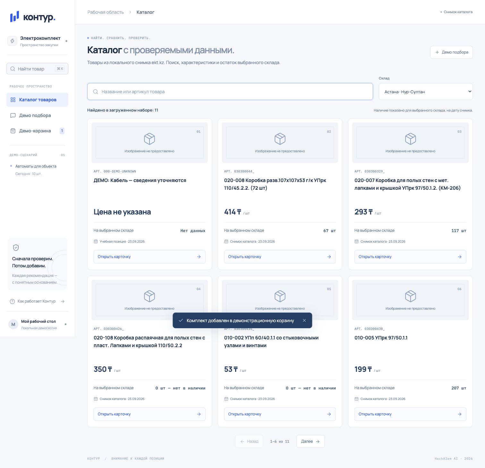

# Контур — проверяемая закупка электротоваров

Прототип консультанта для ekt.kz: подбор товаров по запросу, проверка характеристик и наличия, объяснение аналогов и корзина после явного подтверждения покупателя.

**Текущая версия H1:** основной экран подключён к каталогу FastAPI + SQLite: 11 позиций, выбор склада, серверный поиск, страницы и карточка товара. Это локальный набор из 10 сохранённых карточек API ekt.kz и одной синтетической позиции, а не полный или живой каталог магазина. Каталог H1 проверен в браузере и в чистом клоне на macOS.

Чат, подбор аналога и корзина пока доступны отдельно в разделе «Демо подбора» на учебных данных. Серверная корзина, LLM и H2 ещё не реализованы.



## Запуск готовой сборки без Node.js

Нужны Python 3.12 и uv. Из корня клона:

```text
uv run hack serve
```

Откройте `http://127.0.0.1:8000`. При первом запуске backend создаст `data/app.db` из CSV и отдаст закоммиченный `web/dist`; интерфейс читает каталог через `/api`. API-ключи не нужны, по умолчанию используется `DEMO_MODE=1`. Первичная установка Python-зависимостей требует сети, работа с локальным снимком после установки — нет.

Для явной загрузки сида перед запуском используйте `uv run hack seed`. Это переинициализирует каталог из поставляемого набора, поэтому команду не требуется повторять при каждом открытии приложения.

## Разработка интерфейса

Нужны Node.js 22.12 или новее и npm. Команды одинаковы для терминала macOS и PowerShell Windows 11. В первом терминале из корня проекта запустите backend:

```text
uv run hack serve
```

Во втором терминале, также из корня клона:

```text
cd web
npm ci
npm run dev
```

Откройте адрес Vite, обычно `http://127.0.0.1:5173`: запросы `/api` проксируются на backend `127.0.0.1:8000`. Первичная установка npm-зависимостей требует сети; шрифты и assets входят в сборку и не загружаются с CDN.

После изменений из папки `web` выполните:

```text
npm run build
```

Сборка проверяет TypeScript и создаёт `web/dist`; этот каталог включается в Git. Полную сборку с каталогом открывайте через FastAPI на порту 8000. Node.js нужен только для разработки и пересборки.

## Каталог H1

Главная страница `/` и `/?view=catalog` показывают данные SQLite через API. На странице — до 6 товаров; переключение страниц, поиск по названию или артикулу и выбор склада выполняют новые запросы к серверу. Кнопка поиска и `Ctrl+K` / `⌘K` переводят фокус в поиск каталога.

Склады приходят из `/api/warehouses`: Астана (название источника «Нур-Султан»), Алматы и Шымкент. «Открыть карточку» получает детали через `/api/products/{id}?warehouse_id=...` и показывает цену, минимум, локальный и общий остатки, описание, исходные характеристики, документы и дату снимка.

Примеры для просмотра загруженного набора:

| Поиск по артикулу | Что есть в снимке |
| --- | --- |
| `200300285_` | 64 920 ₸; Астана — 8 шт., Алматы — 5, Шымкент — 2; общий остаток — 23. Описание содержит 160 А, отдельное свойство — 250 А |
| `030300435_` | 53 ₸; Астана — 0 шт., общий остаток — 10 310 шт. |
| `000-DEMO-UNKNOWN` | Синтетическая позиция: цена, минимум и остатки неизвестны |

`null` отображается как «Нет данных», «Цена не указана» или «Не указано»; нулевой остаток — как «0 … — нет в наличии». Исходные описание и свойства сохраняются раздельно. Отсутствующие изображения и сертификаты обозначаются текстом. H1 показывает данные; автоматический подбор и разрешение противоречий в этом каталоге ещё не выполняются.

Источник текущего набора — `demo_fixture`; у 10 сохранённых карточек есть `source_url` API ekt.kz и время снимка `captured_at`. Единица учёта для демо задана явно и отражена в `demo.unit_override`. Наличие относится к снимку, не к текущему состоянию магазина. Внутренний ID `515291` — не поисковый артикул; для этой карточки используйте `200300285_`.

## Отдельное демо подбора и корзины

Откройте «Демо подбора» (`/?view=preview`). Здесь сохранён самостоятельный дизайн-сценарий с тремя учебными позициями из `web/src/design-data.ts`:

1. Рассмотрите паспорт с конфликтом 160/250 А и откройте исходные значения.
2. Выберите учебный аналог, склад и количество. До подтверждения корзина не меняется.
3. Нажмите «Подтвердить комплект», затем «Подтверждаю добавление». Учебный комплект появится на `/cart`.

Чат понимает ограниченные запросы, например «Покажи аналог», «Нужны 5 штук в Алматы», «Какие условия покупки?». Ответы детерминированы, LLM и API каталога в этом демосценарии не вызываются. Сообщение не добавляет товар автоматически.

Демонстрационная корзина содержит один учебный аналог и сохраняется в `localStorage` браузера. Подтверждение задаёт итоговое количество, не прибавляет его повторно. Смена origin (например, между портами 8000 и 5173) означает другое локальное хранилище. Это не серверная корзина H2 и не корзина ekt.kz; реальные позиции каталога H1 в неё не добавляются.

## Границы текущей версии

- Набор каталога H1 ограничен 11 позициями. Интерфейс читает SQLite; синхронизация со всем каталогом магазина не заявляется.
- В «Демо подбора» исходная позиция с противоречивым током и учебный товар на 100 А не добавляются как соответствующие запросу на 160 А. Это проверка заранее заданного сценария, не универсальный подбор электротехнического оборудования.
- Оплата, доставка, загрузка документов, запись в корзину ekt.kz и резервирование не подключены. Условия, которых нет в данных, интерфейс не придумывает.
- Анонимные сессии, серверный чат, предложения и подтверждение корзины относятся к следующему этапу по [контракту API](docs/API-CONTRACT.md). Работа OpenAI и полный H2 пока не заявляются.

## Интерфейс и технологии

Backend: Python 3.12 + FastAPI + SQLite, зависимости через uv. Frontend: React + TypeScript + Vite + Tailwind, собственные компоненты и CSS. Иконки — Lucide; локальные шрифты — Manrope и IBM Plex Mono. В каталоге неизвестное изображение обозначено нейтральной иконкой, в отдельном демо выключатели и знак «Контур» нарисованы средствами CSS.

Дизайн, состояния и лицензии основных frontend-зависимостей описаны в [docs/DESIGN.md](docs/DESIGN.md). [Мобильный каталог](docs/assets/kontur-catalog-mobile.png), [исторический дизайн подбора](docs/assets/kontur-design-desktop.png).

## Проверено в H1

- TypeScript/Vite: сборка проходит. Каталог получает 11 позиций, пагинация показывает 6 + 5.
- Поиск, карточка, три склада и ожидаемые остатки; конфликт 160/250 А остаётся в исходных данных. Нулевой и неизвестный остатки отображаются по-разному.
- Пустой результат и сброс; ошибки списка 503 и карточки 404 с повтором запроса; перевод фокуса в поиск из боковой панели.
- Мобильный экран 390 px без горизонтального переполнения, прокрутка и закрытие карточки. Отдельный старый демосценарий подбора проходит после интеграции.

Подробности и исторические проверки дизайн-прототипа — в [docs/DESIGN.md](docs/DESIGN.md). В чистом клоне macOS проверены `uv run hack serve`, поиск и карточка без внешней сети. `npm ci` и `npm run build` проходят; пересборка совпадает с закоммиченным `web/dist`.

## Начало работы команды

- [Спецификация и этапы H1–H5](docs/SPEC.md).
- [Общий контракт API для backend и frontend](docs/API-CONTRACT.md).
- [Стартовый промт Даниялу: backend H1 на Windows](docs/DANIYAL-H1.md).
- [Журнал проверенных результатов](PROGRESS.md).

Организация работы команды: [памятка для macOS и Windows 11](docs/TEAM.md).
Инструменты Codex: [установка на Windows 11 и проверенный набор](docs/TOOLS.md).

Источник требований: [официальный кейс ekt.kz](https://docs.google.com/document/d/172eSfQ4f3D2wgtsfrs8Lonr1SIwAXLx7jZ7hNccISNk/edit). Запись в production-корзину ekt.kz и оформление заказа не заявляются.
