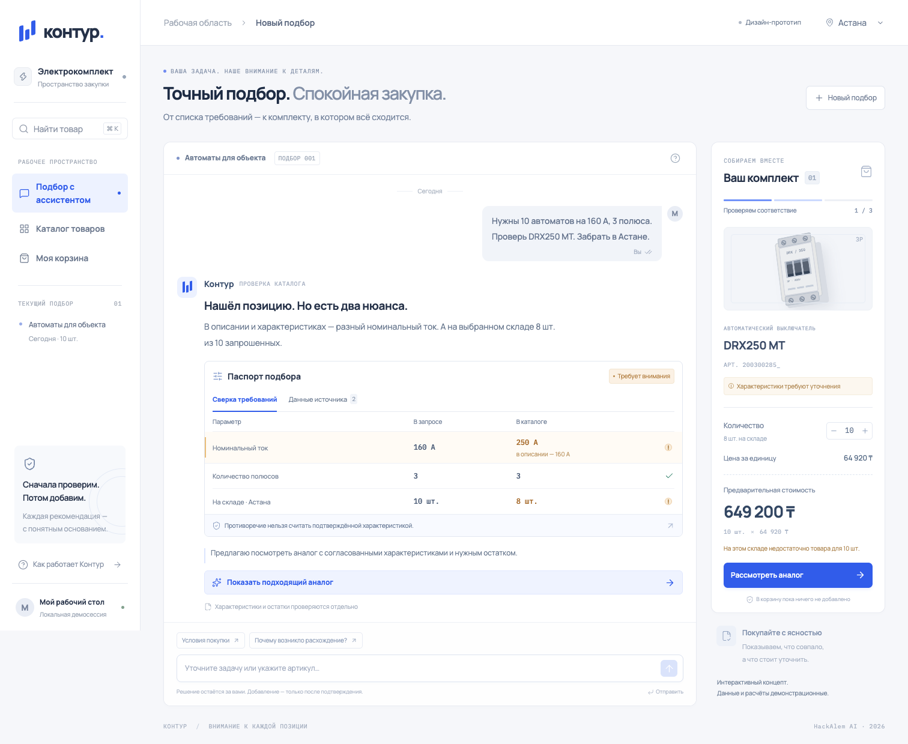

# Контур — проверяемая закупка электротоваров

Прототип консультанта для ekt.kz: подбор товаров по запросу, проверка характеристик и наличия, объяснение аналогов и корзина после явного подтверждения покупателя.

**Текущий статус:** в `web/` готов интерактивный дизайн-прототип. Он показывает сценарий закупки на трёх учебных позициях, работает в браузере и сохраняет демонстрационную корзину локально. Backend, SQLite и реальный каталог пока не подключены; H1 общего приложения не завершён.



## Запуск готовой сборки без Node.js

Нужны Python 3.12 и uv. Из корня клона:

```text
uv run hack serve
```

Откройте `http://127.0.0.1:8000`. При первом запуске backend создаст SQLite из CSV и отдаст закоммиченный `web/dist`. API-ключи не нужны. API каталога доступен отдельно; дизайн пока не читает его.

## Разработка интерфейса

Нужны Git, Node.js 22.12 или новее и npm. Команды одинаковы для терминала macOS и PowerShell Windows 11. Из корня клона:

```text
cd web
npm ci
npm run dev
```

Откройте адрес, который напечатает Vite: обычно `http://127.0.0.1:5173`. Первичная установка зависимостей требует сети; самому прототипу API-ключи и подключение к внешним сервисам не нужны. Шрифты и изображения не загружаются с CDN.

Сборка и просмотр результата:

```text
npm run build
npm run preview
```

`build` проверяет TypeScript и создаёт `web/dist`; этот каталог включается в Git, чтобы будущий backend мог отдавать готовый интерфейс без Node.js у проверяющего. Для preview откройте напечатанный адрес, обычно `http://127.0.0.1:4173`. Корзина привязана к адресу браузера: dev и preview имеют раздельное локальное хранилище.

## Что можно проверить сейчас

1. На главном экране сравните запрос на 160 А с учебной карточкой: паспорт подбора показывает 250 А в характеристиках и 160 А в описании. Откройте вкладку «Данные источника» или окно с объяснением расхождения.
2. Переключите склад между Астаной и Алматы, измените количество. Интерфейс пересчитает стоимость и предупредит, если локального остатка недостаточно.
3. Нажмите «Показать подходящий аналог», затем «Выбрать». На этом шаге корзина ещё не изменяется.
4. Нажмите «Подтвердить комплект», проверьте итог и выберите «Подтверждаю добавление». Комплект появится в «Моей корзине» по пути `/cart`.
5. Откройте каталог `/?view=catalog`: работают поиск по трём позициям, фильтр достаточного остатка и проверка соответствия. Глобальный поиск открывается через `Ctrl+K` или `⌘K`.

Чат поддерживает ограниченный набор запросов: например, «Покажи аналог», «Нужны 5 штук в Алматы», «Какие условия покупки?». Ответы детерминированы и не используют LLM. Фраза в чате не добавляет товар автоматически: подтверждение выполняется отдельной кнопкой.

## Границы текущей версии

- Каталог, цены и остатки заданы в `web/src/design-data.ts` как учебные данные. Это самостоятельный интерфейсный концепт, а не данные из SQLite или актуальная оферта ekt.kz.
- Корзина содержит один поддерживаемый учебный аналог. Подтверждение задаёт итоговое количество, повторное подтверждение не суммирует его. Состав сохраняется в `localStorage` данного браузера; серверных сессий пока нет.
- Исходная позиция с противоречивым током и учебный товар на 100 А не добавляются как соответствующие запросу на 160 А. Это проверка заранее заданного сценария, не универсальный подбор электротехнического оборудования.
- Оплата, доставка, загрузка документов, запись в корзину ekt.kz и резервирование не подключены. Условия, которых нет в данных, интерфейс не придумывает.
- Рабочие данные, анонимные сессии и подтверждение на сервере реализует Даниял по [контракту API](docs/API-CONTRACT.md). Backend H1 уже поступил в репозиторий; текущий интерфейс пока использует учебные данные, даже при запуске через FastAPI.

## Интерфейс и технологии

React + TypeScript + Vite + Tailwind, собственные компоненты и CSS. Иконки — Lucide; локальные шрифты — Manrope и IBM Plex Mono. Иллюстрации выключателей и знак «Контур» нарисованы средствами CSS; внешнего набора фотографий и готовой темы компонентов нет.

Дизайн, состояния и лицензии основных frontend-зависимостей описаны в [docs/DESIGN.md](docs/DESIGN.md). [Мобильный экран](docs/assets/kontur-design-mobile.png).

Проверено: сборка TypeScript/Vite; в Playwright — выбор аналога, отмена без изменения корзины, подтверждение 10 шт. на 615 000 ₸ и сохранение после перезагрузки; блокировка количества сверх остатка, поиск, смена города через запрос, закрытие диалога клавишей Escape. На ширинах 360, 390, 820, 1024 и 1440 px горизонтального переполнения не обнаружено.

## Начало работы команды

- [Спецификация и этапы H1–H5](docs/SPEC.md).
- [Общий контракт API для backend и frontend](docs/API-CONTRACT.md).
- [Стартовый промт Даниялу: backend H1 на Windows](docs/DANIYAL-H1.md).
- [Журнал проверенных результатов](PROGRESS.md).

Организация работы команды: [памятка для macOS и Windows 11](docs/TEAM.md).
Инструменты Codex: [установка на Windows 11 и проверенный набор](docs/TOOLS.md).

Источник требований: [официальный кейс ekt.kz](https://docs.google.com/document/d/172eSfQ4f3D2wgtsfrs8Lonr1SIwAXLx7jZ7hNccISNk/edit). Прототип использует локальную корзину; запись в production-корзину ekt.kz и оформление заказа не заявляются.
