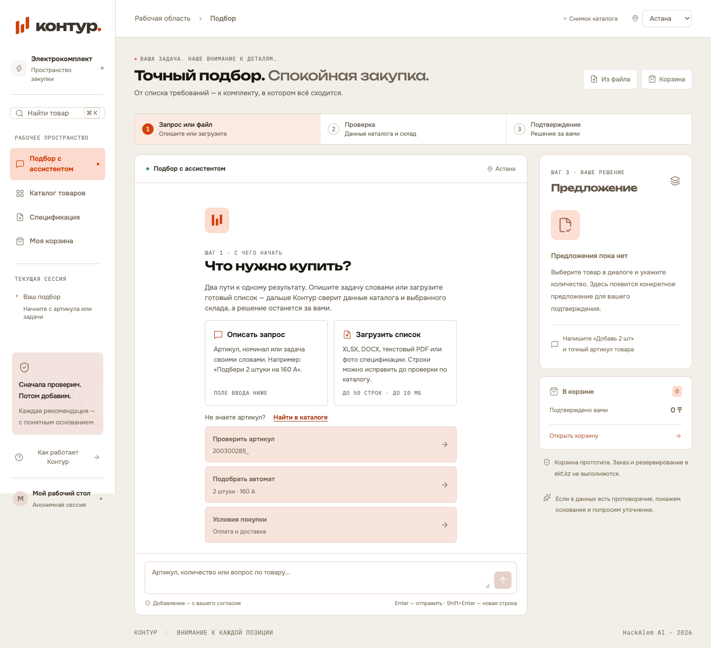
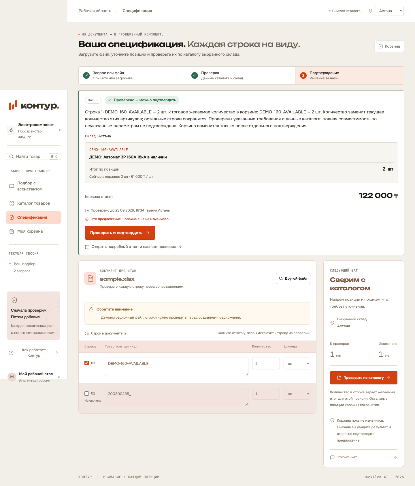
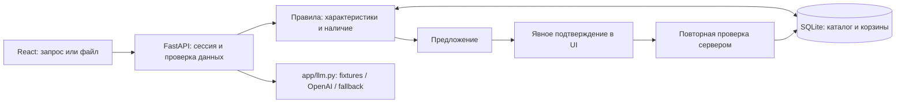

# Контур — проверяемая закупка электротоваров

Помогает закупщику найти товар ekt.kz, проверить характеристики и наличие, исправить спецификацию и собрать корзину после явного подтверждения. Противоречие в каталоге видно до закупки: описание «160 А» и характеристика «250 А» блокируют предложение.

**Состояние:** H1–H3 реализованы; H4 — проверка запуска и подготовка к сдаче. Работает локальный снимок из **13 позиций: 10 карточек ekt.kz и 3 синтетические позиции**. Это не полный и не обновляемый в реальном времени каталог. Редизайн Claude интегрирован; Codex выполняет проверку интеграции и документации. Результат проверки файла и предложение теперь показаны прямо на экране спецификации.




## Проблема и ценность

Закупщик сверяет артикулы, номиналы, количество и склад вручную. Ошибка особенно вероятна, когда описание противоречит свойствам товара. Контур сопоставляет эти сведения, показывает основания проверки и требует решения человека перед изменением корзины.

В поставляемом сценарии две строки проверяются одним списком: конфликтная позиция `200300285_` останавливает подбор, а после её исключения получается предложение на **2 шт за 122 000 ₸**. Это стоимость корзины, а не рассчитанная экономия. Снижение времени закупки и количества ошибок пока не измерялось на пользователях.

## Что умеет

- Искать товары по названию и артикулу; показывать цену, минимум, характеристики, документы и остаток выбранного склада отдельно от общего.
- Отвечать на вопросы о товаре и условиях; предлагать кандидатов по поддерживаемым требованиям с проверкой исходных данных.
- Находить конфликт характеристик, отличать неизвестное значение от нуля и блокировать неподтверждённый подбор.
- Разбирать XLSX, DOCX, текстовый PDF и демонстрационный JPEG; давать исправить или исключить строки до проверки каталога.
- Подготавливать добавление, изменение и удаление позиций; изменять серверную корзину только после явного подтверждения. Корзина сохраняется после перезагрузки.

## Архитектура



LLM разбирает информационные запросы и изображения; цены, доступность и разрешение менять корзину проверяет код. FastAPI раздаёт готовый `web/dist`, поэтому для демонстрации Node.js не нужен. [Устройство приложения и ограничения](docs/ARCHITECTURE.md), [контракт API](docs/API-CONTRACT.md).

## Технологии

Python 3.12, FastAPI, Pydantic и SQLite — один локальный процесс и файл данных. OpenAI SDK — structured outputs с таймаутом, повтором и fallback. React, TypeScript, Vite, Tailwind и собственный CSS — интерфейс без готовой UI-темы; Motion и NumberFlow отвечают за анимации. Lucide и шрифты Onest / Unbounded / IBM Plex Mono включены локально; CDN в runtime нет. Версии закреплены в `uv.lock` и `web/package-lock.json`.

## Быстрый старт

Нужны Python **3.12** и установленный **uv**. Из корня клона:

```text
uv run hack serve
```

Откройте **http://127.0.0.1:8000**. Первый запуск создаст `data/app.db` из поставляемого набора и откроет готовый интерфейс. `DEMO_MODE=1` включён по умолчанию: личные аккаунты, API-ключи и внешняя сеть для работы демо не нужны. Сеть нужна для первоначального скачивания репозитория и установки зависимостей; после этого приложение работает автономно.

## Установка

Клонируйте репозиторий и перейдите в его корень:

```text
git clone https://github.com/BAITC-Hacks/hack-0a6c3bd5-ai-association.git
cd hack-0a6c3bd5-ai-association
uv sync --frozen
uv run hack serve
```

Команды uv одинаковы для macOS и Windows 11 PowerShell. Доступ к приватному репозиторию нужен только для получения кода; авторизация в приложении отсутствует. Если порт 8000 занят: `uv run hack serve --port 8001`.

**Без uv, macOS/Linux** — установленный Python 3.12:

```sh
python3.12 -m venv .venv
.venv/bin/python -m pip install -r requirements.txt
.venv/bin/python -m app.cli seed
.venv/bin/python -m uvicorn app.main:app --host 127.0.0.1 --port 8000
```

**Без uv, Windows 11 PowerShell:**

```powershell
py -3.12 -m venv .venv
.\.venv\Scripts\python.exe -m pip install -r requirements.txt
.\.venv\Scripts\python.exe -m app.cli seed
.\.venv\Scripts\python.exe -m uvicorn app.main:app --host 127.0.0.1 --port 8000
```

Здесь `seed` требуется перед первым прямым запуском uvicorn. Альтернатива после установки зависимостей — `python -m app.cli serve` из активированного окружения: она сама создаёт отсутствующую БД. Для обычного повторного запуска `seed` не нужен.

**Docker Compose** — при установленном Docker и работающем daemon:

```text
docker compose up --build
```

Адрес тот же. Compose включает деморежим, сохраняет БД в именованном томе и подключает `web/dist` из клона только для чтения. Порт 8000 должен быть свободен. Статус проверки альтернативных запусков — в [H4-проверке](docs/QA-H4.md).

## Переменные окружения

Для демо `.env` не требуется. При необходимости скопируйте `.env.example` в `.env` и заполните локально; файл исключён из Git.

| Переменная | По умолчанию | Назначение |
|---|---|---|
| `DEMO_MODE` | `1` | `1`: fixtures и локальные правила; `0`: попытка использовать OpenAI |
| `OPENAI_API_KEY` | Не задана | Локальный ключ для живых вызовов; не включать в Git |
| `OPENAI_MODEL` | Не задана | Явно выбранная модель, совместимая с используемыми structured outputs; для OCR также требуется ввод изображения |
| `DATABASE_PATH` | `data/app.db` в корне проекта | Путь локальной SQLite |
| `ALLOWED_ORIGINS` | `http://127.0.0.1:5173,http://localhost:5173` | Дополнительные разрешённые origin для локального Vite; запросы своего origin также разрешены |
| `EKT_API_USERNAME`, `EKT_API_PASSWORD` | Не заданы | Только для явной команды `hack snapshot`; демо и обычный запуск их не используют |

После изменения `.env` перезапустите сервер. При `DEMO_MODE=0` без ключа/модели или при ошибке OpenAI чат возвращается к проверенным локальным правилам. Для произвольного JPEG без доступного OCR возвращается понятная ошибка: распознавание не подменяется выдуманными строками. Поставляемый JPEG работает по записанному результату. Успешный внешний вызов OpenAI с настоящим ключом ещё не проверен.

## Проверка основного сценария

Используйте новую анонимную сессию, например отдельный профиль браузера; выберите склад «Астана».

1. Откройте `/?view=upload`, раскройте «Нет файла? Возьмите учебный образец», скачайте XLSX (`sample.xlsx`) и загрузите его. Видны **две редактируемые строки**.
2. Нажмите «Проверить по каталогу». На том же экране появится «Нужно уточнение — предложения нет» и конфликт **160 / 250 А** у `200300285_`; корзина пуста.
3. В списке ниже снимите отметку «Включить строку 2» и снова нажмите «Проверить по каталогу». Здесь же появится «Проверено — можно подтвердить» и предложение **2 шт `DEMO-160-AVAILABLE` по 61 000 ₸**, «Корзина станет» — **122 000 ₸**; корзина ещё пуста.
4. Нажмите «Проверить и подтвердить», проверьте склад и состав, затем «Подтверждаю добавление» в диалоге. Сервер изменит корзину. Ссылка «Открыть подробный ответ и паспорт проверок» доступна отдельно; переход в чат для подтверждения файла не требуется.
5. Откройте `/cart` и перезагрузите страницу. Должны сохраниться **2 шт, 122 000 ₸**.
6. Измените количество на 3 через действие корзины. После нового предложения и отдельного подтверждения итог должен стать **183 000 ₸**. Количество означает итог в корзине, а не добавку.

Без файла начните на `/` с «Проверь товар 200300285_», затем «Добавь 2 шт DEMO-160-AVAILABLE». Пошаговая демонстрация с репликами — [DEMO.md](docs/DEMO.md).

## Как это масштабируется

Следующий шаг к пилоту — согласовать права и формат обновления каталога, единиц, документов и условий с партнёром. Адаптер `app/adapters/ekt.py` уже умеет явно получать отдельные карточки; полный импорт и обновление по расписанию в демо не включены. Реальную корзину магазина следует подключать только после получения её API-контракта, сохранив подтверждение и повторную проверку.

Для другого каталога нужны его адаптер и проверяемые предметные правила. Перед расширением нагрузки потребуются измерения времени ответа и ограничений SQLite; текущая версия — локальный прототип для демонстрации, нагрузочные испытания не проводились.

## Ограничения и допущения

- Каталог — локальный снимок из 13 товаров, три склада. Происхождение и дата сохранены в данных; цены и остатки не обещаются актуальными. У 10 карточек указан источник ekt.kz; 3 учебные позиции явно помечены. Единицы набора заданы через `demo.unit_override`.
- `200300285_` стоит 64 920 ₸, остатки снимка: Астана 8, Алматы 5, Шымкент 2; общий остаток 23 не равен сумме трёх выбранных складов. Внутренний ID `515291` — не поисковый артикул.
- `null` означает «Нет данных», а 0 — известное отсутствие. Отсутствующие сертификаты и изображения не заменяются вымышленными.
- Корзина имеет `scope=local_demo`: заказ, оплата и резервирование в ekt.kz не выполняются. Условия покупки демонстрационные, не обещание продавца.
- Файл: до **10 MiB**, до **50 строк**; PDF — до **10 страниц** с текстовым слоем. Поддерживаются XLSX, DOCX, PDF, JPEG. Старые XLS/DOC, сканированные PDF и универсальное OCR не поддерживаются. Любая проблемная включённая строка блокирует предложение по всему списку.
- JPEG без ключа работает только для точного поставляемого образца. Файлы пользователя хранятся локально в SQLite своей сессии и не публикуются как статика. Живой OCR передаёт изображение провайдеру OpenAI; кэш OCR остаётся локальным и исключён из Git.
- Черновик файла и история чата в интерфейсе переживают переходы между экранами, но не перезагрузку. Серверная корзина сохраняется через анонимную HttpOnly cookie. Наличие сообщений в SQLite пока не означает восстановление истории в UI.
- Живой OpenAI/OCR, Windows 11 и Docker отмечаются проверенными только после фактического запуска: актуальные результаты и оставшиеся пункты — [QA-H4.md](docs/QA-H4.md).

## Соответствие критериям задачи

Сопоставление с согласованной [спецификацией кейса](docs/SPEC.md); это описание реализованного поведения, не оценка жюри.

| Критерий | Как реализовано | Где смотреть |
|---|---|---|
| Сведения о товаре, характеристики, сертификаты | Поиск и карточка с исходными полями; документы показываются, если присутствуют в снимке | `/?view=catalog`, `app/api/catalog.py` |
| Наличие по складу | Выбор Астаны, Алматы, Шымкента; отдельные общий и локальный остатки | Карточка товара, `app/db.py` |
| Подбор аналогов и уточнения | Кандидаты по поддерживаемому номинальному току, паспорт конфликтов и блокирующие правила | Чат, `app/agent/consultant.py`, `app/agent/rules.py` |
| Оплата, доставка, минимум | Ответ по поставляемым условиям с обозначением демонстрационного источника | Запрос «Какие условия оплаты и доставки?», `data/purchase_terms.json` |
| Корзина после подтверждения | Предложение → проверка человеком → повторная проверка сервером → локальная корзина | `/cart`, `app/commerce.py` |
| Спецификация из файла | Извлечение → исправление/исключение строк → проверка каталога | `/?view=upload`, `app/documents.py` |
| Запуск без личных доступов | Деморежим по умолчанию, готовая сборка и данные в Git | Быстрый старт, `fixtures/`, `web/dist/` |

## Команда

| Участник | Среда | Вклад |
|---|---|---|
| Даниял — A | Windows 11 | Backend, SQLite, правила, извлечение файлов, API и проверки сервера |
| Мовсар — B | macOS | Интерфейс, интеграция API, сборка, браузерные проверки, документация и демо |

Границы файлов и порядок синхронизации — [TEAM.md](docs/TEAM.md). Редизайн подготовлен с Claude и интегрирован с проверкой Codex. Почасовые результаты — [PROGRESS.md](PROGRESS.md), использование Codex — [codex-log.md](docs/codex-log.md).

## Сторонние компоненты

Версии, лицензии, модели и происхождение данных — [CREDITS.md](CREDITS.md). Тексты лицензий поставляемых UI-компонентов находятся в `web/public/licenses` и готовой сборке.

## Разработка и проверка интерфейса

Нужны Node.js **22.12+** и npm. Оставьте backend на 8000, во втором терминале:

```text
cd web
npm ci
npm run dev -- --port 5173 --strictPort
```

Откройте `http://127.0.0.1:5173`; Vite проксирует `/api` на 8000. Если порт занят, сначала согласуйте остановку прежнего dev-сервера: `--strictPort` предотвращает незаметный переход на неразрешённый backend origin. Для финальной сборки выполните в `web` команду `npm run build`: она проверяет TypeScript и обновляет **обязательно коммитящийся `web/dist`**. Готовый результат проверяйте через FastAPI на 8000. Из корня backend-тесты запускаются командой `uv run pytest -q`.

После объединения редизайна с backend `8cf58fb` прошли **262 backend-теста** и сборка TypeScript/Vite. Playwright проверил на 1440 и 390 px путь: файл → конфликт → исключение строки → предложение → отмена → подтверждение → корзина → перезагрузка. Результат — 2 шт, 122 000 ₸; ошибок JavaScript, внешних обращений и горизонтального переполнения нет. После подтверждения экран файла показывает успешное обновление и переход в корзину. Скриншоты выше обновлены.

Чистый клон объединённой версии запущен командой `uv run hack serve` без ключей и Node: на мобильной ширине пройден путь от файла до подтверждённой корзины и перезагрузки, без внешних обращений и ошибок JavaScript.

До редизайна отдельно проверялись повторы после потери ответа, две вкладки и все четыре формата; полный набор этих проверок в текущем прогоне не повторялся. Результаты объединённой версии — [PROGRESS.md](PROGRESS.md). [CLAUDE-HANDOFF.md](docs/CLAUDE-HANDOFF.md) описывает отправную точку редизайна.
