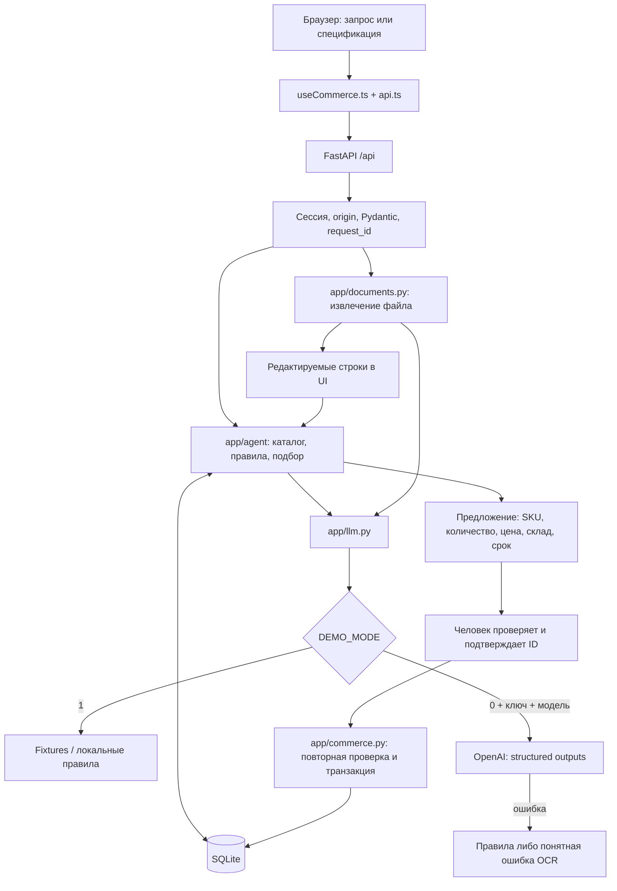

# Архитектура «Контура»

Текущая реализация на 23.09.2026, включая контекст справочных вопросов и отмену предложений при смене документа (backend `8cf58fb`). Один Python-процесс, локальная SQLite и собранный React-интерфейс. Владелец backend — Даниял (A), интерфейса и документации — Мовсар (B).

## От входа до корзины

Предложение ещё не изменяет корзину. LLM не разрешает покупку и не вычисляет итоговую стоимость. Проверяемые факты сервер формирует из каталога и правил.

## Карта модулей

| Файл / каталог | Ответственность |
|---|---|
| `app/cli.py`, `app/config.py` | Запуск, seed, пути, demo/live, явный импорт карточек |
| `app/main.py`, `app/errors.py` | FastAPI, жизненный цикл, статика, единый формат ошибок |
| `app/api/catalog.py` | Каталог, карточка, склады, здоровье API |
| `app/api/chat.py`, `app/api/uploads.py`, `app/api/guards.py` | Сессии, чат, загрузка, подтверждение, origin и снятие разрешения после ошибки |
| `app/db.py`, `app/seed.py` | Схема каталога, чтение SQLite, импорт поставляемого набора |
| `app/commerce.py` | Сессии, предложения, версии корзины, транзакции и идемпотентность |
| `app/agent/consultant.py`, `rules.py`, `uploads.py` | Сопоставление товаров, проверка требований, условия покупки, предложение по строкам |
| `app/agent/context.py` | Однозначные справочные уточнения о последнем товаре и складе; без разрешения менять корзину |
| `app/documents.py`, `app/upload_models.py` | Проверка формата/лимитов, извлечение строк, модель правок |
| `app/llm.py` | Единственная точка OpenAI; Pydantic-схемы, fixtures, кэш, таймаут, fallback |
| `app/adapters/ekt.py` | Явное получение отдельных карточек и преобразование снимка в CSV |
| `web/src/useCommerce.ts` | Клиентская сессия, черновик, операции, повтор запросов и снятие устаревших предложений |
| `web/src/api.ts` | HTTP, типы, проверка ответов, таймауты |
| `web/src/App.tsx`, `*Panel.tsx`, CSS | Навигация, формы, результаты, диалог подтверждения, адаптация |
| `web/dist/` | Готовый интерфейс, шрифты, лицензии и образцы; входит в Git |

## Хранение и источники

`data/app.db` создаётся из CSV и JSON при первом `hack serve`; БД исключена из Git. Каталог: `catalog_meta`, `warehouses`, `products`, `stock`. Исходные свойства и описание сохранены в payload товара раздельно: конфликт не устраняется нормализацией.

Операционные таблицы: `sessions`, `chat_context`, `cart_items`, `proposals`, `messages`, `uploads`, `request_results`. Сессия анонимная, идентификатор передаётся HttpOnly cookie `kontur_session`. Корзины и файлы разделены по сессиям. `uploads` содержит байты файла и извлечённые строки; отдельной публичной ссылки на пользовательский файл нет. Автоматическая очистка пользовательских данных в прототипе не реализована.

История чата и черновик в React остаются в памяти. Перезагрузка не восстанавливает их из SQLite, но загружает серверную корзину. Это текущее ограничение, а не потеря подтверждённой операции.

Демо содержит 10 сохранённых карточек ekt.kz и 3 синтетические позиции. Источник и дата снимка передаются в API; синтетика отмечена отдельно. Известный ноль и отсутствующие данные (`null`) имеют разный смысл. Остатки не обновляются автоматически. [Происхождение данных](../CREDITS.md).

## Контекст справочных вопросов

`app/agent/context.py` дополняет однозначный вопрос вроде «а цена?» артикулом последнего единственного товара. В таблице `chat_context` сохраняются ID товара, склад ответа и склад, выбранный в интерфейсе; цена и остаток заново читаются из каталога. Несколько товаров или отсутствие товара в ответе очищают этот контекст.

Указание одного известного города может изменить склад справочного ответа. Для изменения корзины город в тексте должен совпадать с выбором интерфейса; иначе сервер просит выбрать склад явно. Запросы добавления/удаления не получают артикул из справочного контекста. Неизвестные коды, неоднозначные склады и неподдерживаемые уточнения не подменяются догадкой.

## Подтверждение и повтор операции

1. Запрос пользователя либо проверенные строки файла создают предложение с конкретными товарами, итоговыми количествами, ценами, складом, версией корзины и сроком действия (15 минут).
2. UI показывает предложение; диалог фиксирует именно его ID. Текстовое подтверждение в интерфейсе также адресует этот ID и не отправляет безадресное «да» в чат.
3. Сервер проверяет сессию, статус предложения, срок, склад, версию корзины, цену, доступность и ограничения количества. Только затем транзакция SQLite изменяет корзину. Привязку действия к предложению, показанному именно в этой вкладке, обеспечивает UI.
4. Повтор операции с тем же `request_id` и телом возвращает сохранённый результат. Тот же UUID с другим телом получает 409. Область уникальности — сессия + операция + UUID.

Количество предложения — конечное количество позиции; 0 удаляет её. Товары, не упомянутые в предложении, сохраняются. Повтор не прибавляет товар ещё раз.

После сетевой ошибки, 5xx или некорректного ответа клиент сохраняет UUID и исходные данные для повтора: сервер мог уже выполнить запись. После 401 снимается готовность сессии и очищаются документ/предложение; 409 снимает прежнее предложение и обновляет корзину. Новая загрузка, правка строк или смена склада также снимают возможность подтвердить старый результат в UI. Guard backend при ошибках новых POST сбрасывает контекст короткого текстового «да», сохраняя специальный сценарий предложения с обновившейся ценой. Этот сброс сам по себе не меняет статус старого `pending` ID на `superseded`. Отдельный `supersede_pending_in` после успешной загрузки нового документа отменяет все pending-предложения сессии, включая открытые в другой вкладке, и очищает справочный контекст. При успешно обработанной проверке строк без допустимого предложения старые pending также становятся superseded. Если допустимое предложение создано, прежние отменяет `create_proposal`. Ошибка до успешной обработки документа не равнозначна такой отмене: guard снимает только контекст текстового подтверждения. Клиентские проверки показанного ID сохраняются.

## Файлы и OCR

Лимиты: 10 MiB, 50 строк; PDF до 10 страниц. XLSX, DOCX и PDF с текстовым слоем обрабатываются локально. Старые XLS/DOC и PDF-сканы не поддерживаются. Текст документа считается данными; макросы, внешние связи и написанные внутри инструкции не выполняются.

Пользователь исправляет название/артикул, положительное целое количество и единицу (`шт` или `м`), исключает строки. API принимает только исходные уникальные `line_id`; новый файл нужен для добавления новых строк. Включённая строка с проблемой блокирует предложение по всему списку. Строки одного артикула суммируются в конечное количество.

Для точного демо-JPEG используется fixture по SHA-256; образцы в `fixtures/uploads`, `web/public/examples`, `web/dist/examples` должны совпадать побайтово. Произвольный JPEG требует живой модели с поддержкой изображения. Ошибка OCR даёт `OCR_UNAVAILABLE`, а не искусственные товары.

## Demo и live

- `DEMO_MODE=1` по умолчанию: известные записи из `fixtures/`, остальные поддерживаемые запросы — локальные правила. Внешние API не нужны.
- `DEMO_MODE=0` плюс `OPENAI_API_KEY` и `OPENAI_MODEL`: информационный intent, ограниченное вступление ответа и OCR проходят через `app/llm.py` и `responses.parse` с Pydantic-схемой, `temperature=0`.
- Таймаут SDK: 3 секунды для текста, 5 для OCR; `max_retries=1`. Кэш `fixtures/cache/` исключён из Git; ошибка записи кэша не прерывает работу.
- Ошибка текстовой модели возвращает факты и объяснение перехода к правилам. Для недоступного OCR используется понятная ошибка с предложением другого формата.
- Цена, остатки, сопоставление конфликтов и разрешение изменить корзину не передаются на усмотрение модели.

В живом режиме запрос и выбранные факты могут отправляться OpenAI, а для OCR — изображение. Секреты остаются в окружении; провайдерские исключения не выдаются пользователю как есть. Успешный вызов с настоящим ключом ещё требует проверки; fallback не доказывает работу провайдера.

## Запуск и проверка

FastAPI отдаёт `/`, `/cart`, локальные assets и образцы из `web/dist`. Vite нужен только разработчику и проксирует `/api` на 8000. Swagger/ReDoc отключены из-за CDN; схема доступна на `/openapi.json`.

`uv run hack serve` создаёт отсутствующую БД. Для прямого `uvicorn app.main:app` сначала требуется `python -m app.cli seed`. Compose монтирует готовый `web/dist` из клона и сохраняет БД в отдельном томе. [Команды установки](../README.md), [финальные проверки](FINAL-QA.md), [90-секундное демо](DEMO.md).

При изменении интерфейса сохраняйте правила [DESIGN.md](DESIGN.md) и [API-CONTRACT.md](API-CONTRACT.md): упрощение пути не должно обходить подтверждение, сбрасывать UUID при повторе или переносить деньги и корзину в локальные моки.
